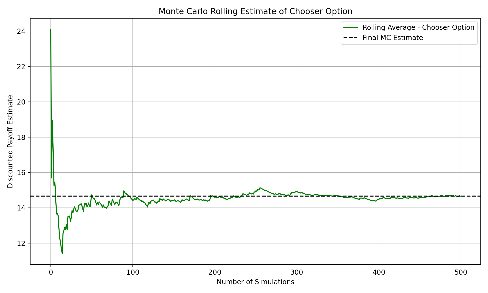
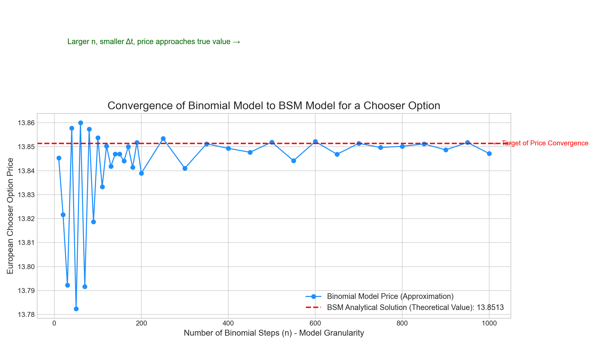

# Chooser Option Pricing Model

Python implementations for pricing **Chooser options** on a CRR binomial tree, with references for European (BSM) and American (Longstaff–Schwartz) variants, plus simple plots/sweeps.

## What's inside
- `Chooser_Option.py` – CRR pricer for a European chooser option; prints price vs. T/U and basic charts
- `BSM_Chooser_Option.py` – Black–Scholes reference for European options
- `Chooser_Option_with_deltaT.py` – CRR pricer with explicit Δt handling
- `Longstaff_Schwartz.py` – LSM example for American-style options
- `requirements.txt` – runtime deps: `numpy`, `matplotlib`

## Notes
- CRR risk-neutral probability: `q = (1 + r - d) / (u - d)`（r、u、d 为“每一步”的参数）
- At decision time `U`, the chooser value is `max(C(U), P(U))`，随后做风险中性折现/回溯至 `t=0`。

## More sample plots

